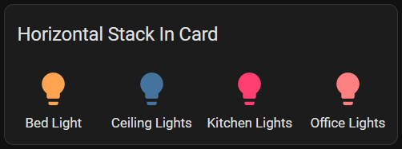
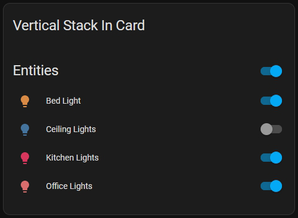
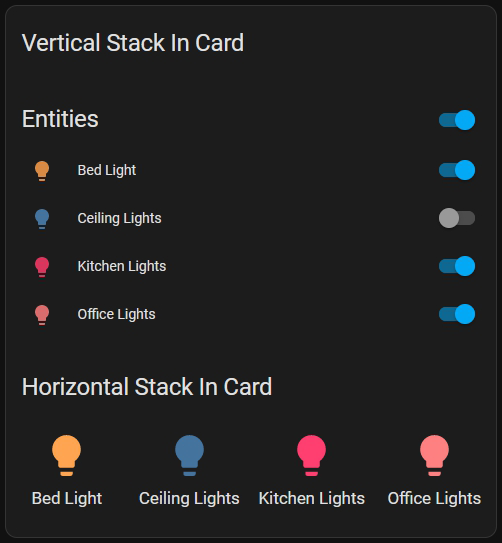

# Stack-In-Card by JuzzWuzz <!-- omit in toc -->

Allows you to group multiple cards into either a horizontal or vertical space in the same column.

<hr>

The horizontal layout



The vertical layout



You can combine the card in itself to create a combination card



<hr>

## Table of Contents <!-- omit in toc -->

- [Configuration](#configuration)
- [Installation](#installation)
- [Examples](#examples)
- [Development](#development)

## Configuration

| Name              | Type    | Default      | Supported options        | Description                                                                                                              |
| ----------------- | ------- | ------------ | ------------------------ | ------------------------------------------------------------------------------------------------------------------------ |
| `type`            | string  | **Required** | `custom:stack-in-card`   | Type of the card                                                                                                         |
| `title`           | string  | optional     | Any string that you want | The title to show for the card                                                                                           |
| `horizontal`      | boolean | `false`      | `true` \| `false`        | Layout for the cards provided. Either horizontally or vertically                                                         |
| `disable_padding` | boolean | `false`      | `true` \| `false`        | Allows for disabling the top and bottom padding. Nested cards will automatically disable padding, which you can override |
| `cards`           | array   | **Required** |                          | An array of all the cards you want                                                                                       |

## Installation

1. Download the [stack-in-card](https://github.com/JuzzWuzz/stack-in-card/releases/latest/download/stack-in-card.js)
2. Place the file in your `config/www` folder
3. Include the card code in your `ui-lovelace-card.yaml`

   ```yaml
   title: Home
   resources:
     - url: /local/stack-in-card.js
       type: module
   ```

4. Write configuration for the card in your `ui-lovelace.yaml`

## Examples

The code snippet below is what was used to generate the combination card shown above

```yaml
- type: custom:stack-in-card
  title: Vertical Stack In Card
  cards:
    - type: entities
      title: "Entities"
      entities:
        - light.bed_light
        - light.ceiling_lights
        - light.kitchen_lights
        - light.office_rgbw_lights
    - type: custom:stack-in-card
      title: Horizontal Stack In Card
      horizontal: true
      cards:
        - type: button
          entity: light.bed_light
        - type: button
          entity: light.ceiling_lights
        - type: button
          entity: light.kitchen_lights
        - type: button
          entity: light.office_rgbw_lights
```

## Development

You can run the code locally by the `Serve` plugin using the `npm start` command. This will compile and serve the code so it can be loaded into a DevContainer or a real instance of Home Assistant.

To make use of DevContainers you'll need the `Dev Containers` extension and then to load the project in the Dev Container.

From there you'll need to start a terminal and execute: `container start`

Other commands:

| Command     | Description                                                            |
| ----------- | ---------------------------------------------------------------------- |
| init        | This will give you a fresh development environment.                    |
| run         | This will run the default action for the container you are using.      |
| start       | This will start Home Assistant on port 9123.                           |
| check       | This will run Home Assistant config check.                             |
| set-version | Install a specific version of Home Assistant.                          |
| upgrade     | Upgrade the installed Home Assistant version to the latest dev branch. |
| help        | Shows this help                                                        |
